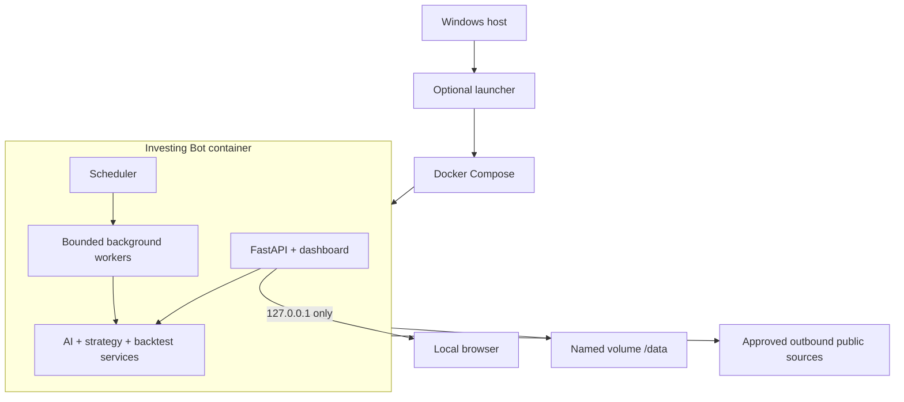

# Architecture

**Status:** Milestones 1–3 implemented; later components proposed<br>
**Last updated:** 2026-08-19

## Components

The application will be a modular Python service packaged in Docker:

- **FastAPI application:** localhost API, dashboard routes, authentication, health, and control actions.
- **Scheduler:** market-calendar-aware periodic and after-close jobs.
- **Source adapters:** `CivicTrackerProvider`, `MarketDataProvider`, `NewsProvider`, and `EarningsProvider`.
- **Entity resolver:** company extraction, alias resolution, ticker verification, and ambiguity handling.
- **AI analysis service:** provider-neutral LLM adapter with validated structured output.
- **Strategy engine:** trusted Python strategy plugins consuming canonical point-in-time bars and candidate metadata.
- **Backtest engine:** event-driven trade/portfolio simulation using the same strategy interface as live research.
- **Persistence:** DuckDB for relational records and Parquet for larger price/history datasets.
- **Dashboard:** Jinja/HTMX views with Plotly charts; no separate JavaScript SPA is required initially.

## Runtime topology



## Service boundaries

Source adapters return canonical records and never write strategy outputs directly. The AI service receives evidence records and never fetches arbitrary URLs. Strategies receive immutable, time-bounded market frames and cannot call the network, LLM, or filesystem. The backtester controls the simulated clock and exposes only information available at each timestamp.

The implemented CivicTracker path follows that boundary: transport adapters
return `SocialPostRecord`; `CivicTrackerCollector` owns paging and job leases;
`SocialPostRepository` owns deduplication, revisions, checkpoints, health, and
collection summaries; read-only FastAPI routes expose recent posts and health.

## Provider subsystem

External services are replaceable per capability, not through one monolithic vendor interface. Narrow protocols cover daily bars, intraday bars, quotes, corporate actions, symbol lookup, news, earnings calendars/results/estimates, cursor-based social posts, and structured LLM analysis. Business services depend only on these protocols and canonical domain models; provider SDKs may be imported only inside their adapters.

A `ProviderRegistry` contains explicitly packaged provider factories. Each exposes a `ProviderManifest` with a stable provider ID, adapter version, authentication requirements, supported capabilities, intervals and historical coverage, rate-limit metadata, canonical schema versions, and optional features. Arbitrary provider code is never loaded from `/data` or from a dashboard-supplied path.

Provider selection is validated at startup and may be changed through the local settings UI or configuration without changing application code or rebuilding the image. A representative configuration is:

```json
{
  "providers": {
    "daily_bars": {"primary": "yfinance", "fallbacks": []},
    "intraday_bars": {"primary": "yfinance", "fallbacks": []},
    "symbol_lookup": {"primary": "yfinance", "fallbacks": []},
    "news": {"primary": "yfinance", "fallbacks": []},
    "earnings": {"primary": "yfinance", "fallbacks": []},
    "social_posts": {"primary": "civictracker_json", "fallbacks": ["civictracker_html"]},
    "llm": {"primary": "groq", "fallbacks": ["cloudflare"]}
  }
}
```

The names above identify initial or illustrative adapters, not hard-coded dependencies. Configuration references encrypted credential IDs; secrets do not appear in the file. The settings screen can test a provider, show supported capabilities, and activate it after validation.

Optional capabilities are feature-gated rather than forced into a lowest-common-denominator API. For example, analyst revisions or streaming quotes can be available from one adapter while ordinary bars come from another. The UI and pipeline distinguish `unsupported`, `temporarily_unavailable`, `stale`, and `missing`.

Provider choice is pinned for the lifetime of each job, analysis, or backtest. Ordered failover may occur only before a unit of work begins or through an explicitly recorded retry after transport failure, quota exhaustion, authentication failure, schema incompatibility, staleness, or an unsupported capability. The system records the trigger and actual provider used, and never silently blends price histories or switches providers halfway through a run.

## Job model

- Use a single scheduler process and a persistent job/run table.
- Acquire a database-backed lease before each job so restarts or duplicate containers cannot run the same task concurrently.
- Give every run an ID, type, requested timestamp, start/end timestamps, code/config versions, status, and error summary.
- Retry transient source failures with exponential backoff and jitter.
- Do not retry validation failures automatically until new data arrives.
- Preserve the last successful published result when a new run fails.

## Local API responsibilities

Versioned endpoints should cover:

- Health, readiness, lock state, and source freshness.
- Current candidates, evidence, AI assessments, and technical setups.
- Historical alerts and prospective outcomes.
- Strategy registry, parameter sets, and backtest requests/results.
- Manual ingestion and analysis triggers.
- Settings presence/status without ever returning stored secret values.
- Provider registry, capability/health status, connection tests, selection, and explicit fallback activity.

All state-changing endpoints require an authenticated local session, same-origin requests, and CSRF validation.

## Docker requirements

- Multi-stage build with pinned Python dependencies.
- Non-root runtime user.
- Read-only application filesystem.
- Named volume mounted at `/data`.
- `tmpfs` for temporary files.
- Dropped Linux capabilities and `no-new-privileges`.
- Port mapping explicitly bound to `127.0.0.1`.
- Health check covering process liveness, database availability, and migration compatibility.
- Graceful shutdown that finishes or safely marks interrupted jobs.

## Failure behavior

- **CivicTracker unavailable:** preserve cursor, retry later, continue other sources.
- **Yahoo response incomplete:** quarantine the batch, retry in smaller batches, and block affected signals.
- **LLM unavailable:** preserve evidence and technical data; label AI analysis unavailable rather than fabricate output.
- **Price stream disconnected:** mark live prices stale, reconnect with backoff, and avoid new confirmations until a complete bar is rebuilt.
- **Migration mismatch:** fail readiness and leave stored data untouched.
- **Backtest failure:** retain prior results and the full failed run record.
- **One provider unavailable:** mark only its capabilities degraded; unrelated deterministic functions remain ready.
