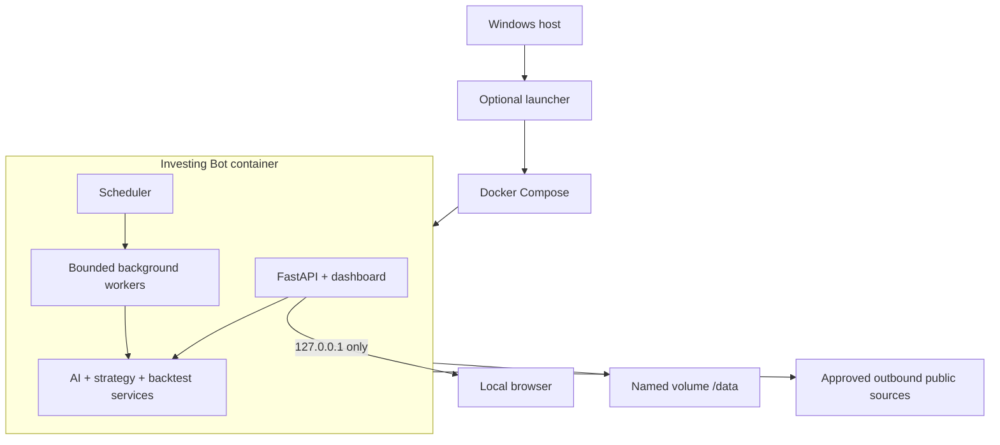

# Architecture

**Status:** Proposed implementation architecture 
**Last updated:** 2026-08-03

## Components

The application will be a modular Python service packaged in Docker:

- **FastAPI application:** localhost API, dashboard routes, authentication, health, and control actions.
- **Scheduler:** market-calendar-aware periodic and after-close jobs.
- **Source adapters:** `CivicTrackerProvider`, `MarketDataProvider`, `NewsProvider`, and `EarningsProvider`.
- **Entity resolver:** company extraction, alias resolution, ticker verification, and ambiguity handling.
- **AI analysis service:** provider-neutral LLM adapter with validated structured output.
- **Strategy engine:** trusted Python strategy plugins consuming canonical point-in-time bars and candidate metadata.
- **Backtest engine:** event-driven trade/portfolio simulation using the same strategy interface as live research.
- **Persistence:** DuckDB for relational records and Parquet for larger price/history datasets.
- **Dashboard:** Jinja/HTMX views with Plotly charts; no separate JavaScript SPA is required initially.

## Runtime topology

## Service boundaries

Source adapters return canonical records and never write strategy outputs directly. The AI service receives evidence records and never fetches arbitrary URLs. Strategies receive immutable, time-bounded market frames and cannot call the network, LLM, or filesystem. The backtester controls the simulated clock and exposes only information available at each timestamp.

## Job model

- Use a single scheduler process and a persistent job/run table.
- Acquire a database-backed lease before each job so restarts or duplicate containers cannot run the same task concurrently.
- Give every run an ID, type, requested timestamp, start/end timestamps, code/config versions, status, and error summary.
- Retry transient source failures with exponential backoff and jitter.
- Do not retry validation failures automatically until new data arrives.
- Preserve the last successful published result when a new run fails.

## Local API responsibilities

Versioned endpoints should cover:

- Health, readiness, lock state, and source freshness.
- Current candidates, evidence, AI assessments, and technical setups.
- Historical alerts and prospective outcomes.
- Strategy registry, parameter sets, and backtest requests/results.
- Manual ingestion and analysis triggers.
- Settings presence/status without ever returning stored secret values.

All state-changing endpoints require an authenticated local session, same-origin requests, and CSRF validation.

## Docker requirements

- Multi-stage build with pinned Python dependencies.
- Non-root runtime user.
- Read-only application filesystem.
- Named volume mounted at `/data`.
- `tmpfs` for temporary files.
- Dropped Linux capabilities and `no-new-privileges`.
- Port mapping explicitly bound to `127.0.0.1`.
- Health check covering process liveness, database availability, and migration compatibility.
- Graceful shutdown that finishes or safely marks interrupted jobs.

## Failure behavior

- **CivicTracker unavailable:** preserve cursor, retry later, continue other sources.
- **Yahoo response incomplete:** quarantine the batch, retry in smaller batches, and block affected signals.
- **LLM unavailable:** preserve evidence and technical data; label AI analysis unavailable rather than fabricate output.
- **Price stream disconnected:** mark live prices stale, reconnect with backoff, and avoid new confirmations until a complete bar is rebuilt.
- **Migration mismatch:** fail readiness and leave stored data untouched.
- **Backtest failure:** retain prior results and the full failed run record.
