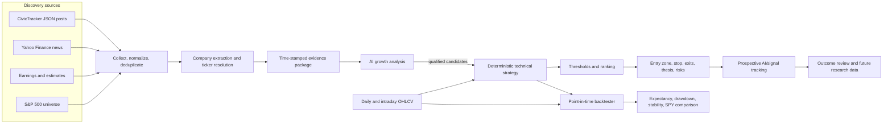

# Project Outline

**Status:** Ingestion through deterministic strategy hypotheses implemented; backtesting is next 
**Last updated:** 2026-08-21

## System flow

## Major workstreams

| Workstream | Purpose | Version-one deliverable |
|---|---|---|
| Source ingestion | Collect timely evidence without duplicating work | Social posts, news, earnings, universe, and OHLCV through replaceable capability adapters |
| Entity resolution | Convert text mentions into verified public tickers | Alias registry, configured symbol lookup, confidence/manual-review states |
| AI research | Assess evidence-based growth potential | Structured score, catalysts, risks, uncertainty, citations |
| Technical strategy | Decide whether a trade setup exists | Trusted Python plugin interface and baseline strategies |
| Backtesting | Determine whether rules have a durable edge | Event-driven, point-in-time portfolio and trade simulation |
| Intraday monitoring | Detect new evidence and completed-bar triggers | Scheduled polling, active shortlist, alert lifecycle |
| Dashboard | Make decisions inspectable | Sources, candidates, charts, strategy reasons, backtests |
| Security/operations | Keep the local tool private and recoverable | Docker hardening, encrypted credentials, backups, health checks |
| Provider operations | Change APIs without changing business logic | Registry, manifests, connection tests, capability health, provenance, and controlled fallback |

## Operating cycles

### During market hours

1. Poll CivicTracker every 15–30 minutes with backoff and caching.
2. Refresh broad news periodically and active-candidate news more frequently.
3. Refresh earnings events and evidence when new reports appear.
4. Update the active shortlist only when material evidence changes.
5. Monitor active tickers and evaluate technical rules on completed intraday bars.
6. Create or update alerts using states: `forming`, `confirmed`, `invalidated`, `expired`, and `closed`.

### After market close

1. Reconcile daily and intraday price history.
2. Validate freshness, corporate actions, missing symbols, and universe coverage.
3. Run the complete AI growth screen and deterministic ranking.
4. Generate the daily report.
5. Update prospective outcome tracking.
6. Run scheduled backtests only when strategy code, parameters, or data versions change; ordinary daily operation updates forward results without needlessly rerunning every research experiment.

## Selection policy

The system does not force recommendations. A company must pass all applicable gates:

1. Valid, tradable ticker with adequate data.
2. Material and sufficiently credible evidence.
3. AI growth/evidence score above the configured threshold.
4. No blocking data-quality or event-risk flag.
5. Active technical entry setup.
6. Minimum configured reward-to-risk.

Qualifying companies are ranked and capped for display. If none qualify, the correct output is **no current setup**.

## Boundary between AI and backtesting

- AI discovery and qualitative growth assessment are saved exactly as produced and evaluated prospectively.
- Historical backtests cover deterministic rules and only those historical filters for which point-in-time data actually exists.
- The dashboard must never merge those result sets in a way that implies the current AI model made historical decisions it did not make.

## Version-one exclusions

- RAG and semantic vector search.
- Full document ingestion.
- Automated brokerage orders.
- Short positions and leverage.
- Execution-grade, sub-minute day trading.
- A performance guarantee or mandatory daily picks.
